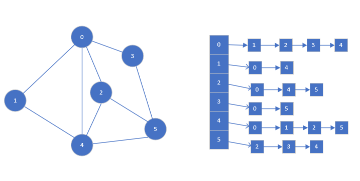

# 数据结构与算法

​		外修语言，内修算法，数据结构+算法是一个程序运行的保障，数据结构指的是数据的组成方式，如数组、数和链表等。数据结构可以分为线性数据结构和非线性数据结构，线性结构的特点是数据元素之间存在一一对应的关系，存储方式可以分为顺序表和链表，两者最大的不同在于存储的地址是否连续，典型的线性结构为<u>数组、链表、队列和栈</u>。非线性结构的特点是数据元素之间不存在一一对应的关系，典型的非线性结构有<u>二维数组、多维数组、广义表和树结构</u>

## 一、数组

### 1、稀疏数组

​		若一个二维数组中的元素存在很多0值或者无效值，可以将这个二维数组压缩为稀疏数组（去除0值和无效值）。可以应用在底图、棋盘等二维场景中。


1.1二维数组转稀疏数组

①遍历原始的二维数组，得到有效的数据个数sum

②构造稀疏数组，第一行原始数组的行、列和有效数据的个数，其余行为有效值的行列坐标和存储的值

```java
sparseArr[sum+1][3]
```

1.2稀疏数组转二维数组

①取出稀疏数组的第一行，构造二维数组

②取出稀疏数组的其余行，为对应的二维数组赋值。

### 2、队列（数组实现）

队列如同现实中的排队一样，它的特点是先入先出，是一种有序列表，可有由数组或者是链表构成。

2.1数组模拟队列


队列的输入输出分别队列的后、前端。对应的处理方法为加入数据和输出数据。(其前提是插入元素的个数要小于数组容量的个数，否则会发生越界错误，<u>因为tail是指向队尾的后一个位置</u>)

* 构造队列
* 判断队列是否为空 head !=tail
* 队列是否满 tail !=maxSize
* 加入队列   (先加入，后tail++)
* 退出队列 

对用的属性为maxSize、head（队头）、tail（队尾的后一个元素位置）

2.2环形队列

基本数组模拟队列会导致数组不能复用，所以优化方法是让数组构成环形队列。


环形队列的基本思想是首尾相连。

* 构造队列

* 判断队列是否有空位置   head！=tail

* 判断队列是否满 (tail+1)%maxSize==head

* 加入队列，更新队头(tail+1)%maxSize

* 退出队列，更新队尾(head+1)%maxSize

* 队列长度（tail+maxSize-head）%maxSize

* 队列的索引变为 ：

  ```java
  for(i=head;i<head+(tail+maxSize-head)%maxSize;i++){
      System.out.println(arr[i%maxSize])
  }
  ```

## 二、链表(Linked List)

链表是以节点（node）存储的链式存储结构，一个node包含一个data域（存放数据）和一个next域（存放下一个node的指针），链表的各个节点不一定是连续的，它可以分为带头结点和不带头结点。头结点仅包含next域。

### 1、单向链表

1.1顺序插入

* 创建节点类，包含了data和next，next指向下一个节点对象

  >```java
  >class PersonNode {
  >public int number;
  >public String name;
  >public String nickName;
  >public PersonNode next;
  >
  >public PersonNode(int number, String name, String nickName) {
  >   this.number = number;
  >   this.name = name;
  >   this.nickName = nickName;
  >}
  >
  >@Override
  >public String toString() {
  >   return "PersonNode{" +
  >           "number=" + number +
  >           ", name='" + name + '\'' +
  >           ", nickName='" + nickName + '\'' +
  >           '}';
  >}
  >}
  >```

* 创建单向链表类，里面包含了<u>增删改查的方法</u>

* 在链表类创建head Node，头节点的next指向第一个节点

* 实现增删改查的方法


* 在链表中增加一个节点

> 确定要插入的节点位置，循环遍历到该位置节点的上一个节点。	
>
> ```C
> S->next=P->next
> P->next=S
> ```

* 在链表中删除一个节点

> 确定删除的位置，循环遍历到该位置节点的上一个节点
>
> ```C
> P->next=p->next->next
> ```

* 遍历链表

  ```java
   PersonNode temp = headNode;
          while (true) {
              if (temp.next == null) {
                  break;
              }
              temp = temp.next;
              System.out.println(temp);
          }
  ```

* 修改链表中的一个节点信息

> 确定要修改节点的位置，先遍历找到该节点，修改该节点的信息。

### 2、双向链表

双向链表是在单向链表的基础上加入pre指针，因此支持双向的增删改查。

>```java
>	public int number;
>public String name;
>public String nickName;
>public PersonNode next;
>public PersonNode pre;
>```

* 双向链表的遍历

>双向链表的遍历与单向链表相同，可以按照两个方向遍历。

* 双向链表的添加

>1、在末尾添加
>
>
>
>在双向链表的末尾添加C节点（定位到节点B）
>
>```java
>B->next=C
>C->pre=B
>```
>
>2、在两节点间添加
>
>
>
>在节点B和节点C间添加D（程序定位到节点D），
>
>顺序：**先搞定D的前驱和后继节点，再搞定C的节点的前驱和B的后继节点。**
>
>```java
>D->pre=B
>D->next=C
>C->pre=D
>B->next=D
>```

* 双向链表的修改

>同单链表修改相同

* 双向链表的删除

>1、在链表尾部删除（定位到节点P（B））
>
>
>
>2、在两节点间删除（定位到节点S（D））
>
>

### 3、单向循环链表（无头结点）

单向循环链表是首尾相连，使整个单链表构成一个环。约瑟夫问题时单向循环链表的一个典型的应用

约瑟夫问题描述：

>约瑟夫问题是一个非常著名的趣题，即由n个人坐成一圈，按顺时针由1开始给他们编号。* 然后由第一个人开始报数，数到m的人出局。现在需要求的是最后一个出局的人的编号。* 给定两个int n和m，代表游戏的人数。请返回最后一个出局的人的编号.

问题分析：

约瑟夫问题可以简单分为两个步骤

构造Boy节点类

```java
 private int number;
 private Boy next;
```


* 构建一个单向循环链表

>
>
>定义两个指针变量First和cur，first表示头结点，cur指向当前节点
>
>```java
>构造第一个节点first
>first = boy;//第一个节点为first
>first.setNext(first);//仅有一个节点时，first指向first，构成闭环
>cur = first;//辅助变量指向first
>构造其它节点 
>cur.setNext(boy);//将新添加的节点设置为当前节点的后继节点
>boy.setNext(first);//新添加的节点与first构成闭环
>cur=boy;//将当前节点设置为新添加的节点
>```

* 根据约定的规则退出循环链表，直至仅有一个节点

>
>
>定义两个辅助节点变量first和helper，first指向每一轮要开始的节点，helper指向最后一个节点，当first与helper指向同一个节点时，该循环链表仅剩一个节点
>
>```java
>构造函数
>moveCycle(int no,int number,int sum)
>1、确定从第几个节点开始
>for(int i=0;i<no-1;i++){
>       first=first.getNext();
>       helper=helper.getNext();
>   }
>2、循环，找出节点，直至仅剩一个节点
>while (true){
>       if(first==helper){
>           System.out.printf("最后一个节点时%d\n",first.getNumber());
>           break;
>       }
>       //开始,每number下，出圈一次
>       for(int j=0;j<number-1;j++){
>           first=first.getNext();
>           helper=helper.getNext();
>       }
>       System.out.printf("%d出圈\n",first.getNumber());
>       first=first.getNext();
>       helper.setNext(first);
>   }
>```

## 三、栈（Stack）

### 1、栈的概念

​	栈与队列相反，队列是在队头进入，队尾出队的线性表，栈是仅能在栈顶进行插入和删除的线性表(先入先出)。我们通常把允许插入和删除的一端成为栈顶，另一端称为栈底。栈的插入操作为入栈，栈的删除操作为出栈，不含任何数据元素的栈称为空栈。


栈的表示：

* 用数组模拟栈
* 用链表模拟栈

### 2、栈的应用场景

前缀、中缀和后缀表达式

* 前缀表达式是运算符在前，数字符在后

> (3+4)*5-6  ====>  - * + 3 4 5 6

* 中缀表达式，我们通常书写的表达式的形式

>(3+4)*5-6  

* 后缀表达式，数字符在前，运算符在后

> (3+4)*5-6 =====>3 4 + 5 * 6

中缀表达式转后缀表达式

* 初始化两个栈，运算符栈s1和存储中间结果的栈s2（也可用list来表示）；
* 从左到右扫描中缀表达式
* 遇到操作数时，将其压入s2，
* 遇到运算符时，比较其与栈顶元素符的优先级：

>* 如果s1为空，或栈顶符号为左括号“（ ”，则直接将运算符入栈
>* 否则，若优先级比栈顶优先级高，将运算符压入栈s1
>* 否则，将s1栈顶的运算符弹出并压入到s2中，转到第四步继续循环

* 遇到括号时：

>如果是左括号“（ ”，直接压入s1
>
>如果是右括号“ ）”，则依次弹出s1栈顶运算符，并压入s2，直到遇到左括号为止，此时将这一对括号丢弃。	

* 重复上述步骤，直至表达式的最右边
* 将s1中的剩余运算符依次弹出并压入s2
* 依次弹出s2中的元素并输出，结果的逆序为中缀表达式对应的后缀表达式。

#### 2.1 四则表达式的运算（模拟计算器）


* 采用中缀表达式的方式计算，中缀表达式为“7+2*6-4”传统形式的表达式。

>1、通过一个index索引查找表达式的符号
>
>2、若当前指向的符号为数字，就放入数字栈中，若是符号就放入符号栈中
>
>3、当index指向运算符时，若此时符号栈为空，直接入栈，若符号栈不为空，则比较index指向的符号与栈顶的符号的优先级，若index指向的运算符大于等于栈顶的运算符时，将index指向的运算符入栈，否则将数字栈中前两位运算符（num1、num2）出栈，符号栈中的栈顶指向的运算符出栈，运算后**(num2运算符num1)**放入数字栈中。
>
>4、当表达式扫描完毕，就顺序的从数字栈和符号栈中pop出相应的数字和符号进行运算。
>
>5、当数字栈中仅有一个元素时，就是表达式的值。

* 采用后缀表达式计算 9 3 1 -3 * +10 2 / +

>1、通过一个index索引查找表达式的符号
>
>2、若当前指向的符号为数字，就放入数字栈中，若是符号，就将处于栈顶的里两个数字出栈，并进行运算
>
>3、将结算结果进栈，一直到最终获得结果。

#### 2.2、递归

递归（recursion）是指通过重复将问题分解为同类的子问题而解决问题的方法。简单来说，递归就是自己调用自己。

递归需要遵守的规则：

>1、执行一个方法时，就创建一个新的受保护的独立空间（栈空间）
>
>2、方法的局部变量是独立的，不会互相影响
>
>3、如果方法中使用的是引用类型的变量（比如数组），就会共享该引用类型的数据。
>
>4、递归必须向退出递归的条件逼近，否则就是无限递归，出现StackOverFlowError
>
>5、当一个方法执行完毕，或者遇到return，就会返回，遵守谁调用，就将结果返回给谁，同时当方法执行完毕或者返回时，该方法也就执行完毕。

例子：


```java
 public static  void getValue(int value){
        if(value>2){
            getValue(value-1);
        }
        System.out.println("the value is "+value);

    }
```

递归的的经典算法

* 迷宫

  描述：有一个迷宫地图，有一些可达的位置，也有一些不可达的位置（障碍、墙壁、边界）* 。从一个位置到下一个位置只能通过向上（或者向右、或者向下、或者向左）走一步来实现，从起点出发，如何找到一条到达终点的通路。

  分析：

>```java
>定义一个二维数组，1表示位置不可到达，2表示通路可以走，3表示位置已经走过，走不通，0表示还未走过的点
>* 采用递归的算法
>* 1、map表示地图
>* 2、i,j表示从地图的那个位置开始出发（1,1）
>* 3、如果小球到map[i][j](终点)位置，则说明通路找到
>* 4、策略：下->右->上->左（算法的优化是策略的变化）
>```

* 八皇后问题

  描述：在一个8*8的国际象棋上摆放八个皇后，使其不能相互攻击，即任意两个皇后都不能处于同一行、同一列或同一斜线上，共有多少种摆法？

  分析：

>```java
>1、第一个皇后放在第一行第一列
>2、第二个皇后放在第二行第一列，然后判断是否Ok，如果不Ok，继续放在第二列、第三列，依次把所有列都放完，找到一个合适的
>3、继续放第三个皇后，继续放第一列、第二列，.......直到第8个皇后放在一个不冲突的位置，这就算找到了一个正确解
>4、当找到一个正确解时，在栈回退到上一个栈时，就会开始回溯，即将第一皇后放到第一列的所有正确解，全部得到
>5、然后回头继续第一个皇后放第二列，后面继续执行1,2,3,4步骤
>说明：
>使用一个1维数组来表示，arr[8]={0,4,7,5,2,6,1,3}，下标对应第几行，arr[i]=value,value表示第i+1个皇后放在第i+1列。
>```

## 四、排序（Sort Algorithm）

### 1、概念

排序的概念：排序是将一组数据按照指定的顺序进行排列的过程。

排序可以分为内部排序和外部排序，内部排序是将处理的所有数据都加载到内部存储器中进行排序。

若数据量过大，无法全部加载到内存中，需要借助于外部存储进行排序。

1.1、内部排序

* 插入排序

>直接插入排序、希尔排序

* 选择排序

>简单选择排序、堆排序

* 交换排序

>冒泡排序、快速排序

* 归并排序
* 基数排序

1.2外部排序

### 2、排序算法

#### 2.1冒泡排序

概念：冒泡排序是一种交换排序，它的基本思想是：按照某种排序规则，两两比较相邻的元素的关键字，如果是反序则交换，直到没有反序的记录为止。

* 普通的冒泡算法

  ```java
  for (int i = 0; i < arr.length - 1; i++) {
              for (int j = 0; j < arr.length - 1 - i; j++) {
                  if (arr[j] > arr[j + 1]) {
                      swap(arr, j, j + 1);
                  }
              }
              System.out.println(Arrays.toString(arr));
          }
  ```

  

* 优化排序算法

  存在这样一种情况，没有数据交换时，即说明此序列已经有序了，即不再需要判断后面的数据了，我们需要优化代码，即**当序列已经有序时，不再对后面的数据进行判断。**

  ```java
   boolean flag = true;
          for (int i = 0; i < arr.length - 1&&flag; i++) {
              flag=false;
              for (int j = 0; j < arr.length - 1 - i; j++) {
                  if (arr[j] > arr[j + 1]) {
                      swap(arr, j, j + 1);
                      flag = true;
                  }
              }
              System.out.println(Arrays.toString(arr));
          }
  ```

#### 2.2简单选择排序

概念：**即通过n-i次关键字间的比较，从n-i+1（包括自己）个记录中选出关键字最小的记录，并和第i个记录交换。**

```java
for (int i = 0; i < arr.length - 1; i++) {
            int minSize = i;
            int min = arr[minSize];
            for (int j = i + 1; j <= arr.length - 1; j++) {
                if(min>arr[j]){
                    minSize=j;
                    min=arr[j];
                }
            }
            if(i!=minSize){
                arr[minSize]=arr[i];
                arr[i]=min;

            }
        }
```

#### 2.3直接插入排序

概念：把n个待排序的元素*看**成一个有序列表和一个无序表***，开始时有序表只包含一个元素，无序表中包含n-1个元素，排序过程中每次从无序表中取出第一个元素，把它的排序码依次与有序表元素的排序码进行比较，将它插入到有序表中的适当位置，使之成为新的有序表。

```java
int insertScrpt=0;//要插入的位置
        int insertValue=0;//插入的值
        for(int i=1;i<=arr.length-1;i++){
            insertScrpt=i-1;
            insertValue=arr[i];
            while (insertScrpt>=0&&insertValue<arr[insertScrpt]){
                arr[insertScrpt+1]=arr[insertScrpt];//向后移
                insertScrpt--;
            }
            if(insertScrpt+1!=i){
                arr[insertScrpt+1]=insertValue;
            }
        }
```

#### 2.4希尔排序

概念：希尔排序是把记录按下标的一定增量分组，对每组使用直接插入排序算法排序；随着增量的逐渐减少，每组包含的关键词越来越多，当增量减至1时，整个文件掐被分成一组，算法终止。

* 交换法（时间复杂度为17s左右）

  ```java
  int temp = 0;
          for (int increment = arr.length / 2; increment > 0; increment = increment / 2) {
              for (int i = increment; i < arr.length; i++) {
                  for (int j = i - increment; j >= 0; j -= increment) {
                      if (arr[j] > arr[j + increment]) {
                          temp = arr[j];
                          arr[j] = arr[j + increment];
                          arr[j + increment] = temp;
                      }
                  }
              }
              System.out.println(Arrays.toString(arr));
          }
  ```

* 移位法（时间复杂度为1s左右）

  ```java
  for (int increment = arr.length / 2; increment > 0; increment = increment / 2) {
  
              for (int i = increment; i < arr.length; i++) {
                  int j = i;
                  int temp = arr[j];
                  if (arr[j] < arr[j - increment]) {
                      while (j - increment >= 0 && temp < arr[j - increment]) {
                          arr[j] = arr[j - increment];
                          j -= increment;
                      }
                      arr[j] = temp;
                  }
              }
              System.out.println(Arrays.toString(arr));
          }
  ```

#### 2.5快速排序

思想：快速排序是对冒泡排序的一种改进，通过一趟排序将要排序的数据分割成独立的两部分，其中一部分的所有的数据比另一部分的所有数据都要小，然后按此方法对这个两部分数据分别进行快速排序，整个排序过程可以递归进行，以此达到整个数据变成有序序列。

```java
public static void quickSort(int[] arr,int left,int right){
        int l=left;
        int r=right;
        int temp=0;
        int privot=arr[(right+left)/2];
       while (l<r){
           while (arr[l]<privot){
                l++;
           }
           while (arr[r]>privot){
               r--;
           }
           if(l>=r){
               break;
           }
           temp=arr[l];
           arr[l]=arr[r];
           arr[r]=temp;

           if(arr[l]==privot){
               r--;
           }
           if(arr[r]==privot){
               l++;
           }
       }
       if(l==r){
           l+=1;
           r-=1;
       }
       //左递归
        if (left<r){
            quickSort(arr,left,r);

        }
        //向右递归
        if(right>l){
            quickSort(arr,l,right);
        }
    }
```

#### 2.6归并排序（MergeSort）

归并排序是利用归并的思想进行排序的方法，采用经典的**分治策略**（分治是将问题分解成一些小问题然后递归求解，然后就将各个阶段的答案修补在一起）

**网上找的图解**


这种结构很像一个完全二叉树，我们采用递归的方法去实现，也可以采用迭代方法去实现，分阶段可以理解为递归拆分子序列的过程。

* 序列的拆分

  ```java
      public static void mergeSort(int[] arr, int left, int right, int[] temp) {
          if (left < right) {
              int mid = (left + right) / 2;
              //向左递归分解
              mergeSort(arr, left, mid, temp);
              //向右递归分解
              mergeSort(arr, mid + 1, right, temp);
              //合并
               merge(arr, left, mid, right, temp);
          }
      }
  ```

* 序列的合并

  ```java
  /**
       * 合并
       *
       * @param arr   原始数组，待排序的数组
       * @param left  数组的左边坐标
       * @param mid   数组的中间坐标
       * @param right 数组的右边坐标
       * @param temp  临时数组
       */
      public static void merge(int[] arr, int left, int mid, int right, int temp[]) {
          int i = left;//初始化i，左边序列的初始索引
          int j = mid + 1;//初始化j，右边序列的初始索引
          int t = 0; //临时变量的索引
          //1、将拆开的左右数组中的元素分别比较大小，并放入临时数组，直至某一数组被放完
          while (i <= mid && j <= right) {
              if (arr[i] < arr[j]) {
                  temp[t] = arr[i];
                  i++;
                  t++;
              } else {
                  temp[t] = arr[j];
                  j++;
                  t++;
              }
          }
  
          //2、将剩下数组的元素全部移动到临时数组中
          while (i <= mid) {
              temp[t] = arr[i];
              i++;
              t++;
          }
          while (j <= right) {
              temp[t] = arr[j];
              j++;
              t++;
          }
          //3 将临时数组的元素合更新到原数组
          t = 0;
          int tempLeft = left;
          while (tempLeft <= right) {
              arr[tempLeft] = temp[t];
              t++;
              tempLeft++;
          }
  
      }
  ```

#### 2.7基数排序（桶排序的扩展）

算法描述：基数排序就是分离出数字的每一位，根据每一位的大小放入指定的桶中，桶用数组来表示，共分成编号为0-9的桶。如249，分离个位时，249放入编号为9的桶中，分离十位时，246放入编号为4的桶中，分离千位时，249放入编号为0的桶中。存在负数的序列不能使用基数排序。

基本思想：将所有待比较数值统一为同样的数位长度，数位较短的数前面补零，然后，从最低位开始，依次进行一次排序，这样从最低位排序一直到最高位排序完成以后，数列就变成一个有序序列。

```java
 public static void radisSort(int[] arr){
        //找出最大数并确定位数
        int max=arr[0];
        for(int i=1;i<arr.length;i++){
            if(max<arr[i]){
                max=arr[i];
            }
        }
        int maxLength=(max+"").length();
        //定义桶，为了防止元素溢出，需要将每个桶的容量都定义为:arr.length
        int[][] bucket=new int[10][arr.length];
        //定义一个数组bucketElementCount[],用来记录每个桶中放入的元素的数量
        int[] bucketElementCount=new int[10];
        /**
         * 将数据元素放入桶中
         */
        for(int l=0,n=1;l<maxLength;n=n*10,l++){
            for(int i=0;i<arr.length;i++){
                int endDigital=arr[i]/n%10;
                bucket[endDigital][bucketElementCount[endDigital]]=arr[i];
                bucketElementCount[endDigital]++;
            }
            /**
             * 取出元素
             */
            int index=0;
            for(int i=0;i<bucket.length;i++){
                if(bucketElementCount[i]!=0){
                    for(int j=0;j<bucketElementCount[i];j++){
                        arr[index]=bucket[i][j];
                        index++;
                    }
                }
            //将bucketElemnetCount清零
                bucketElementCount[i]=0;
            }
            System.out.println(Arrays.toString(arr));
        }

    }
```

#### 2.8排序算法总结


## 五、查找

### 1、概念

### 2、查找算法

常用的查找算法有**顺序（线性）查找**、**二分查找**、**（折半）查找**、**插值查找**、**斐波那契查找**

#### 2.1顺序查找

顺序查找(Sequential Search)又叫线性查找，是最基本的查找技术，它的查找过程：从表中第一个（或最后一个）记录开始，逐个进行序列中的元素与给定值的比较，若序列中的元素和给定值相等，则查找成功；如果知道最后一个（或第一个）元素，其元素和给定值的比较都不相等，则表中没有所查的元素，则查找不成功。

```java
  public static int sequenceSearch(int[] arr,int value){
        int temp=0;
        for(int i=0;i<arr.length;i++){
            if(arr[i]==value){
                temp=i;
                break;

            }else {
                temp= -1;
            }

        }
        return temp;
    }
```

#### 2.4二分查找

算法描述（保证在序列有序）

* 首先确定该数组的中间下标

  ```jave
  mid=(left+right)/2
  ```

* 然后让需要查找的数find Val和arr[mid]比较

  ```java
  find>arr[mid],说明要查找的数在mid的右边，需要递归的向右查找。
  find<arr[mid],说明要查找的数在mid的左边，需要递归的向左查找。
  findVal==arr[mid]说明找到，就返回
  ```

* 什么时候我们需要结束递归

  ```java
  找到就结束递归
  递归完整个数组，仍然没有找到findVal,也需要结束递归，当left>right就需要退出
  ```

代码实现1（查找序列中的元素，查找一个）

```java
 public static int binarySearch(int[] arr, int left, int right, int value) {
        int mid = (right + left) / 2;
        if (left > right) {
            return -1;
        }
        if (value > arr[mid]) {
            //向右递归
            return binarySearch(arr, mid + 1, right, value);
        } else if (value < arr[mid]) {
            //向左递归
            return binarySearch(arr, left, mid - 1, value);
        } else {
            return mid;
        }
    }
```

代码实现2（查找指定元素在序列中的全部位置下标）

```java
 public static ArrayList<Integer> binarySearch2(int[] arr, int left, int right, int value) {
        int mid = (right + left) / 2;
        if (left > right) {
            return new ArrayList<>();
        }
        if (value > arr[mid]) {
            //向右递归
            return binarySearch2(arr, mid + 1, right, value);
        } else if (value < arr[mid]) {
            //向左递归
            return binarySearch2(arr, left, mid - 1, value);
        } else {
            ArrayList<Integer> list = new ArrayList<>();
            int temp = mid-1;
            //向左索引
            while (true) {
                if (temp< 0 ||arr[temp] != value) {
                    break;
                }
                list.add(temp);
                temp--;
            }
            //向右索引
            temp=mid+1;
            while (true) {
                if (temp > arr.length - 1 ||arr[temp] != value) {
                    break;
                }
                list.add(temp);
                temp++;
            }
            list.add(mid);
            return list;
        }
    }
```

#### 2.5插值查找

插值查找算法并不是简单的从中间进行的，它是根据我们需要查询的值渐渐进行搜索的，即根据与所求值的距离进行搜索，其钱前提条件保证序列有序。

```java
mid=left+(right-low)*(findValue-arr[left])/(arr[right]-arr[left])
```

Note：

* 对于数据量较大，序列中的数据分布比较均匀，采用插值查找，速度较快
* 序列中的数据分布不均匀，插值查找不一定会比折半查找好

```java
 public static int insertValueSearch(int[] arr,int left,int right,int findValue){
        if(left>right||findValue<arr[left]||findValue>arr[right]){
            return -1;
        }
        int mid=left+(right-left)*(findValue-arr[left])/(arr[right]-arr[left]);
        if(findValue>arr[mid]){
            //向右递归
           return insertValueSearch(arr,mid+1,right,findValue);
        }
      else if(findValue<arr[mid]){
            //向左递归
           return insertValueSearch(arr,left,mid-1,findValue);
        }
      else {
          return mid;
        }
    }
```

#### 2.6斐波那契查找

算法描述：

斐波那契算法是以斐波那契数列为基础（又称黄金分割数列），它的前一项与后一项的比值随着数字量的增多逐渐逼近黄金分割比值0.618。所以斐波那契查找改变了二分查找中原有的中值mid的求解方式，其mid不再代表中值，而是代表黄金分割点。

> 1、如果与给定的值相同，则查找成功，返回在表中的位置。
>
> 2、如果比给定的值小，向右查找并减少2个斐波那契空间
>
> 3、如果比给定值大，向左查找并减少1个斐波那契空间
>
> 4、重复过程，直到找到给定的值（成功）或区间为空集（失败）

```java
   //斐波那契算法查找
    public static int fibonacciSearch(int[] arr, int findValue) {
        int left = 0;
        int right = arr.length - 1;
        int mid = 0;
        int k = 0;//记录斐波那契分隔数值的下标
        int f[] = fib();//获得斐波那契数列

        while (right > f[k] - 1) {
            k++;
        }
        //对数组a中的元素数量与斐波那契f[k]值相等
        int[] temp = Arrays.copyOf(arr, f[k]);
        //将填充的元素等于原数组的最后一个元素，进行元素补充
        for (int i = right + 1; i < temp.length; i++) {
            temp[i] = temp[right];
        }

        //斐波那契查找
        while (left <= right) {
            mid = left + f[k - 1] - 1;
            if (findValue < temp[mid]) {
                //分割点左边的数据继续进行分割
                right = mid - 1;
                k--;
            } else if (findValue > temp[mid]) {
                //对分割点右边的数据继续进行分割
                left = mid + 1;
                k -= 2;
            } else {
                if (mid < right) {
                    return mid;
                } else {
                    return right;
                }

            }
        }
        return -1;
    }
```

## 六、hashTable

散列表(Hash Table)，也叫哈希表，是根据关键码值（Key Value）而直接进行访问的数据结构。也就是说，它通过关键码值映射到表中的一个位置来访问记录，这样我们就可以通过查找关键码值而不需要比较就可获得需要的记录的存储位置。

散列技术是在记录的存储位置和它的关键字之间建立一个确定的对应关系f，使得每个关键字key对应一个存储位置f(key)

```
存储位置=f(关键字)
```

f为散列函数，又称哈希（hash）函数。

采用散列技术将记录存储在一块连续的存储空间中，这块连续的存储空间称为散列表或哈希表(Hash Table)

哈希表是由**数组+链表组成**


根据关键字查找时，使用hash函数确定存储位置（数组中一个下标），确定下标后，遍历链表找到要索引的结果。数组中存储的是从链表的头结点。

## 七、树结构（基础）

### 1.为甚么需要树？

* 数组：

>优点：根据下标检索时速度很快，当序列有序时，可以采用二分查找等算法来提高检索效率
>
>缺点：插入（扩容、移动等操作）、删除时（移动）效率较低下下

* 链表

> 优点：删除、插入时效率较高，不需要连续的存储空间
>
> 缺点：检索时效率较低

* 数

>可以提高存储、读取的效率，如二叉排序树(Binary Sort tree)，即可以保证数据的检索速度，同时也可以保证数据的插入、删除、修改的速度。

### 2.树的概念


* 结点
* 根结点，A是所有节点的根节点，一棵树只有一个根结点
* 父结点，A是结点B和结点C的父结点，B是结点D和结点E的父结点
* 子结点，结点B和结点C时结点A的子结点
* 叶子结点，没有子结点的结点
* 结点的权，结点的值，
* 路径，从某一个节点到另一结点的路线
* 层，如图，共4层
* 子树，结点D和结点H可以构成子树，其子树的根节点是D
* 树的高度，最大层数
* 森林，多颗子树构成森林

### 3.二叉树

定义：每个结点最多只能有两个子结点（左结点和右结点）的形式

#### 3.1满二叉树

定义：所有的叶子结点都在最后一层，结点数位2^n-1，n为层数


#### 3.2完全二叉树

定义：如果二叉树的所有叶子结点都在最后一层或者倒数第二层，最后一层的叶子结点左边连续，倒数第二层的叶子结点右边连续，称为完全二叉树


#### 3.4二叉树遍历

* 前序遍历

  先输出父结点，在输出左结点、最后输出右结点

  ```java
     public void preOrder() {
          System.out.println(this);
          if (this.leftNode != null) {
              this.leftNode.preOrder();
          }
          if (this.rightNode != null) {
              this.rightNode.preOrder();
          }
      }
  ```

* 中序遍历

  先输出左结点，再输出父结点，最后输出右结点

  ```java
     public void infixOrder() {
          if (this.leftNode != null) {
              this.leftNode.infixOrder();
          }
          System.out.println(this);
          if (this.rightNode != null) {
              this.rightNode.infixOrder();
          }
      }
  ```

* 后序遍历

  先输出左结点，再输出右结点，最后输出父结点

  ```java
   public void postOrder() {
          if (this.leftNode != null) {
              this.leftNode.postOrder();
          }
          if (this.rightNode != null) {
              this.rightNode.postOrder();
          }
          System.out.println(this);
      }
  ```

#### 3.4二叉树查找指定结点

* 前序遍历查找

  ```java
  public PersonNode preOrderSearch(int no) {
          //判断当前节点是否为要查找的节点
          if (this.no == no) {
              return this;
          }
          //判断当前节点的左节点是否为空，不为空时继续左递归查找
          PersonNode resNode = null;
          if (this.leftNode != null) {
              resNode = this.leftNode.preOrderSearch(no);
          }
          //判断左递归后查询的节点是为空
          if (resNode != null) {
              return resNode;
          }
          //若左递归查询无果，则香油递归，直接返回结果
          if (this.rightNode != null) {
              resNode = this.rightNode.preOrderSearch(no);
          }
          return resNode;
      }
  ```

* 中序遍历查找

  ```java
  public PersonNode infixOrderSearch(int no) {
          PersonNode resNode = null;
          //判断当前节点的左节点是否为空，不为空时进行中序递归判断
          if (this.leftNode != null) {
              resNode = this.leftNode.infixOrderSearch(no);
          }
          //判断递归后的值是否为空，不为空，则证明在左子树上找到
          if (resNode != null) {
              return resNode;
          }
          //判断当前结点是否为自己想要查找的
          if (this.no == no) {
              return this;
          }
          //若坐左子树和当前结点都不是我们要查询的，则判断右结点是否为空，不为空时，则进行中序查找递归
          if (this.rightNode != null) {
              resNode = this.rightNode.infixOrderSearch(no);
          }
          return resNode;
      }
  ```

* 后序遍历查找

  ```java
    public PersonNode postNodeSearch(int no) {
          PersonNode resNode = null;
          //判断当前结点的左结点是否存在，若存在则进行左结点的后续遍历查找递归
          if (this.leftNode != null) {
              resNode = this.leftNode.postNodeSearch(no);
          }
          //左子树查找到
          if (resNode != null) {
              return resNode;
          }
          //若没有左子树查找到，则判断右结点是否存在，存在时进行后序遍历查找递归
          if (this.rightNode != null) {
              resNode= this.rightNode.postNodeSearch(no);
          }
          //右子树查找到
          if(resNode!=null){
              return resNode;
          }
          //判断当前节点是否为要查找的结点
          if (this.no == no) {
              resNode= this;
          }
          return resNode;
      }
  ```

  #### 3.5二叉树指定结点的删除

  前提：先判断根结点，根结点的判断不在此代码中。

  ```java
  public void delNode(int no){
          //判断左边结点是否为空，非空时判断是否为要查找的结点
          if(this.leftNode!=null&&this.leftNode.no==no){
              this.leftNode=null;
          }
          //判断右边结点是否为空，非空时判断是否为要查找的结点
          if(this.rightNode!=null&&this.rightNode.no==no){
              this.rightNode=null;
          }
          //判断左子结点是非为空，不为空时进行递归查找删除
          if(this.leftNode!=null){
              this.leftNode.delNode(no);
          }
          //判断右子结点是非为空，不为空时进行递归查找删除
          if(this.rightNode!=null){
              this.rightNode.delNode(no);
          }
      }
  ```

#### 3.5顺序存储二叉树

概念：从数据存储上看，数组存储的方式与树的存储方式可以相互转换


给定一数组，完成二叉树的遍历

>顺序存储二叉树通常只考虑完全二叉树，n为该节点在数组中的下标。
>
>1、第n个元素的左子结点为n*2+1
>
>2、第n个元素的左子结点为n*2+2
>
>3、第n个元素的父结点为（n-1）/2

* 前序遍历

  ```java
  public void preOrder(int index) {
          if (arr != null && arr.length > 0) {
              System.out.println(arr[index]);
              if (index * 2 + 1 < arr.length) {
                  //在左结点递归
                  preOrder(index * 2 +1);
              }
              if (index * 2 + 2 < arr.length) {
                  //在右结点递归
                  preOrder(index * 2 +2);
              }
          }
      }
  ```

* 中序遍历

  ```java
    public void infixOrder(int index) {
          if (arr != null && arr.length > 0) {
              if (index * 2 + 1 < arr.length) {
                  //在左结点递归
                  infixOrder(index * 2 +1);
              }
              System.out.print(arr[index]);
              if (index * 2 + 2 < arr.length) {
                  //在右结点递归
                  infixOrder(index * 2 +2);
              }
          }
      }
  ```

* 后序遍历

  ```java
   public void postOrder(int index) {
          if (arr != null && arr.length > 0) {
              if (index * 2 + 1 < arr.length) {
                  //在左结点递归
                  postOrder(index * 2 +1);
              }
              if (index * 2 + 2 < arr.length) {
                  //在右结点递归
                  postOrder(index * 2 +2);
              }
              System.out.print(arr[index]);
          }
      }
  ```

#### 3.6线索化二叉树的构造

概念：有N个结点的二叉树会存在N+1个空指针，可以将这些空指针理解为线索（每个结点有2个指针，共2N个指针，将N个结点连接起来需要N-1个指针，所以剩余指针为：2N-(N-1)=N+1）。而二叉树线索化的过程中，会利用书中的空指针作为寻找当前结点的前驱和后继的线索。为了区分树中的指针是指向子树还是线索，定义了leftType和rightType标识符，其意义如下：

>* 如果leftType为0，则表示指向左子结点；若leftType=1,则表示指向前驱结点。
>* 如果rightType为0，则表示指向右子结点；若leftType=1,则表示指向后继结点。

图解如下：**图解采用采用中序遍历的方式构造线索化二叉树，同理，有前序构造二叉树和后序构造二叉树**

蓝色实线代表左右子树，虚线红色代表前继节点，虚线绿色代表后继结点。


```java
  //定义当前结点的前驱结点
    PersonNode pre=null;
    //参数中的node为需要线索化的结点
    public void threadedNodes(PersonNode node){
        if(node==null){
            return;
        }
        //线索化左子树
        threadedNodes(node.getLeftNode());
        //线索化当前结点
        if(node.getLeftNode()==null){
            //让当前结点的左指针指向前驱结点
            node.setLeftNode(pre);
            //修改当前结点的左指针类型
            node.setLeftNodeType(1);
        }
        //处理后继结点
        if(pre!=null&&pre.getRightNode()==null){
            //让前驱结点的右指针指向当前结点
            pre.setRightNode(node);
            //修改前驱结点的右指针类型
            pre.setRightNodeType(1);
        }
        //每处理一个结点后，让当前结点是下一个结点的前驱结点。
        pre=node;
        //线索化右子树
        threadedNodes(node.getRightNode());
    }
```

#### 3.7线索化二叉树的查找

线索化二叉树后，各个结点的指向均会发生变化，原来的遍历（前序、中序和后序）方式不能在使用。我们需要使用新的遍历方法。可以采用线性查找的遍历的方法，不需要再使用递归的方法。

**修改中序遍历方法遍历线索化二叉树**

```java
 public void listThreadedBinaryTree() {
        PersonNode node = root;
        while (node != null) {
            while (node.getLeftNodeType() == 0) {
                node = node.getLeftNode();
            }
            System.out.println(node);

            while (node.getRightNodeType() == 1) {
                node = node.getRightNode();
                System.out.println(node);
            }
            node = node.getRightNode();
        }

    }
```

## 八、树结构（应用）

### 1、堆排序

堆排序描述：堆排序是利用堆这种数据结构而设计的一种排序算法。它的最好、最坏和平均时间复杂度都是O(nlogn)

堆是这样一种数据结构

>* 大顶堆：每个结点的值大于等于其左右孩子的结点的值
>* 小顶堆：每个结点的值小于等于其左右孩子结点的值

数组和二叉树可以相互转换，我们可以利用数组的存储结构，二叉树的逻辑结构进行排序

排序步骤：

* 将无序序列构建成一个堆，根据升序或者降序构造大顶堆或者小顶堆（以大顶堆为例）
* 将堆顶元素与末尾元素交换，将最大的元素放置在数组的尾端
* 重新调整以满足堆结构，继续交换堆顶元素与数组末尾元素，直到整个序列有序

图解：

1、构造大顶堆


2、交换堆顶和末尾的元素


3、将数组长度减1，继续构造新的大顶堆。

代码实现

```java
public class HeapSort {
    public static void main(String[] args){
        int[] arr={4,6,8,5,9,-44,11,98,3};

        //将无序序列构建成一个堆，根据升序或者降序的需求构造大顶堆或者小顶堆
        //arr.length-1/2是为了找到最后一个非叶子结点
        for (int i=arr.length/2-1;i>=0;i--){
            adjustHeap(arr,i,arr.length);

        }
        //将堆顶元素与末尾元素交换，将最大的元素放置在数组的尾端
        //重新调整以满足堆的结构，继续交换堆顶元素与数组末尾元素，直到整个序列有序
        for(int j=arr.length-1;j>0;j--){
            int temp;
            //交换
            temp=arr[j];
            arr[j]=arr[0];
            arr[0]=temp;
            adjustHeap(arr,0,j);
        }
        System.out.println(Arrays.toString(arr));
    }

    /**
     * @param arr 数组（二叉树）
     * @param i 传进的非叶子结点坐标
     * @param length 数组的长度
     */
    public static void adjustHeap(int[] arr,int i,int length){
        int temp=arr[i];
        for(int k=i*2+1;k<length;k=k*2+1){
            //找到最大的子结点
            if(k+1<length&&arr[k]<arr[k+1]){
                k++;
            }
            if(temp<arr[k]){
                arr[i]=arr[k];
                i=k;//将i等于非叶子结点的左子结点坐标
            }
            //将非叶子结点的值赋给与它交换的子结点
            arr[i]=temp;
        }
    }
}
```

### 2.霍夫曼树

**概念：**霍夫曼树是一种特殊的二叉树，给定n个权值作为n个叶子结点，若该树的带权路径长度达到最小，这样的二叉树称为最优二叉树，也称为霍夫曼树。即霍夫曼树就是带权路径长度WPL最小的二叉树。


> 树的路径长度是从树根到每一结点路径长度之和。
>
> 带权路径长度是路径的长度乘以结点上的权值
>
> 图中的带权路径长度为：
>
> ```java
> 5*2+4*2+8*1=26
> ```

**霍夫曼树的构造图解：**


**代码实现**

```java
   public static Node  huffmanTree(int[] arr) {
        List<Node> nodes = new ArrayList<>();
        //将数组中的值转换成结点
        for (int vale : arr) {
            nodes.add(new Node(vale));
        }
        while (nodes.size() > 1) {

            //按权重的值从小到大排序
            Collections.sort(nodes);
            //取出权值较小的两个结点组成二叉树
            Node leftNode = nodes.get(0);
            Node rightNode = nodes.get(1);

            //以这两个结点的权重相加的值组成他们的父节点，
            Node parent = new Node(leftNode.value + rightNode.value);
            parent.left=leftNode;
            parent.right=rightNode;
            //将此二叉树的两个子结点从list中移除，并将父节点加入到list中构成新的list
            nodes.remove(leftNode);
            nodes.remove(rightNode);
            nodes.add(parent);


        }
        return nodes.get(0);
    }
```

### 3、霍夫曼编码

概念：霍夫曼编码是可变字长编码方式（VLC）的一种，该方法完全依据字符出现的概率来编码。

定长编码是采用ASCII对字符编码

|    字母    |  A   | B    | C    | D    | E    | F    |
| :--------: | :--: | ---- | ---- | ---- | ---- | ---- |
| 二进制字符 | 000  | 001  | 010  | 011  | 100  | 101  |

这样真正传输的数据就是编码后的**”000001010011011100101“**，对方接收时可以按照3位一分来译码，但是如果传输的数据量很大，这样的二进制串的数量将会是非常庞大。

霍夫曼是将每个字符出现的频率作为权值构造霍夫曼树，按照权值最小路径长度进行编码

假设六个字母的频率A：27，B：8，C:15, D:15, E：30 ，F：5

构建霍夫曼树：


对从树根到叶子经过的路径的0或1来编码，做路径为0，右路径为1，因此可得霍夫曼编码树为


|    字母    |  A   |  B   |  C   |  D   |  E   |  F   |
| :--------: | :--: | :--: | :--: | :--: | :--: | :--: |
| 二进制字符 |  01  | 1001 | 101  |  00  |  11  | 1000 |

所以采用霍夫曼编码为：01100110100111000

将生成的霍夫曼的编码每8位转成一个byte[]={-88, -65, -56, -65, -56, -65, -55, 77, -57, 6, -24, -14, -117, -4, -60, -90, 28}

压缩率：(40-17)/40=57%

Note：霍夫曼排序方法的同会造成霍夫曼编码的不同，但是wpl是一样的，都是最小的。

**代码实现：**

* 构造霍夫曼树

  ```java
     public static Node createHuffmanTree(List<Node> nodes) {
          while (nodes.size() > 1) {
              //排序
              Collections.sort(nodes);
              Node leftNode = nodes.get(0);
              Node rightNode = nodes.get(1);
              Node parentNode = new Node(null, leftNode.weight + rightNode.weight);
              parentNode.leftNode = leftNode;
              parentNode.rightNode = rightNode;
              //在集合中删除子结点并加入父结点
              nodes.remove(leftNode);
              nodes.remove(rightNode);
              nodes.add(parentNode);
          }
          return nodes.get(0);
      }
  ```

* 根据霍夫曼树生成霍夫曼编码

  ```java
  private static void getCodes(Node node, String code, StringBuilder stringBuilder) {
          StringBuilder stringBuilder2 = new StringBuilder(stringBuilder);
          stringBuilder2.append(code);
          if (node != null) {
              if (node.data == null) {
                  //向左递归
                  getCodes(node.leftNode, "0", stringBuilder2);
                  //向右递归
                  getCodes(node.rightNode, "1", stringBuilder2);
              } else {
                  //表明是叶子结点
                  huffmanCodes.put(node.data, stringBuilder2.toString());
              }
          }
      }
  ```

* 对霍夫曼编码进行压缩(每8位压缩成一个byte)

  ```java
  byte[]={-88, -65, -56, -65, -56, -65, -55, 77, -57, 6, -24, -14, -117, -4, -60, -90, 28}
  ```

  ```java
    private static byte[] zip(byte[] bytes,Map<Byte,String> huffmanCodes){
          StringBuilder stringBuilder=new StringBuilder();
          //遍历byte数组
          for(byte b:bytes){
              stringBuilder.append(huffmanCodes.get(b));
          }
          //煤8位转成一个byte
          int len ;
          if(stringBuilder.length()%8==0){
              len=stringBuilder.length()/8;
          }else {
              len=stringBuilder.length()/8+1;
          }
          //创建存储压缩后的数组
          byte[] huffmanCodeBytes=new byte[len];
          int index=0;
          for (int i=0;i<stringBuilder.length();i+=8){
              String strByte;
              if(i+8>stringBuilder.length()){
                  strByte=stringBuilder.substring(i);
              }else {
                  strByte=stringBuilder.substring(i,i+8);
              }
              //将strByte转成一个byte，放入到huffmanCodeBytes,二进制每8位表示一个byte
              huffmanCodeBytes[index]= (byte) Integer.parseInt(strByte,2);
              index++;
          }
          return huffmanCodeBytes;
      }
  ```

### 4、霍夫曼解码

霍夫曼解码是将byte[]数组转成二进制字符串“1000100001..................”，然后对照霍夫曼表解出对应的字符串。

代码实现

* 将byte数组转成二进制字符串

  ```java
      /**
       * j将byte转成二进制字符串
       * @param flag 标志着是否需要补高位，为true时需要补高位，false时不需要
       * @param b    传入的byte
       * @return 对应的二进制字符串
       */
      private static String byteToBitString(boolean flag, byte b) {
          //将b转成int
          int temp = b;
          //如果是正数我们需要补高位
          if (flag) {
              temp |= 256;//与256按位或
          }
          String str = Integer.toBinaryString(temp);//返回的是temp对应的二进制补码
          if (flag) {
              return str.substring(str.length() - 8);
          } else {
              return str;
          }
  
      }
  ```

* 对照霍夫曼表生成对应的字符串"1000111000"===>"i like like like java do you like a java"

  ```java
   private static byte[] decode(Map<Byte, String> huffmanCodes, byte[] huffmanBytes) {
          //1、先得到huffmanBytes，对应的二进制字符串"1000111000"
          StringBuilder stringBuilder = new StringBuilder();
          //将byte数组转成二进制字符串
          for (int i = 0; i < huffmanBytes.length; i++) {
              byte b = huffmanBytes[i];
              boolean flag = (i == huffmanBytes.length - 1);
              stringBuilder.append(byteToBitString(!flag, b));
          }
          //将字符串按照指定的霍夫曼编码进行解码
          //将霍夫曼编码表进行调换，可以进行反向查询，即 a->100,
          Map<String, Byte> map = new HashMap<String, Byte>();
          for (Map.Entry<Byte, String> entry : huffmanCodes.entrySet()) {
              map.put(entry.getValue(), entry.getKey());
          }
          //创建集合存放Byte
          List<Byte> list = new ArrayList<>();
          //i可以理解为索引扫描StringBuilder
          for (int i = 0; i < stringBuilder.length(); ) {
              int count = 1;
              boolean flag = true;
              Byte b = null;
              while (flag) {
                  //1010100000111.....
                  //递增取出key
                  String key = stringBuilder.substring(i, i + count);
                  b = map.get(key);
                  if (b == null) {//说明没有匹配到
                      count++;
                  } else {
                      flag = false;
                  }
              }
              list.add(b);
              i += count;
          }
          //当for循环结束后，list中就存放了"i like like like java do you like a java"
          //把list中的数据放入到byte[],并返回
          byte b[] = new byte[list.size()];
          for (int i = 0; i < b.length; i++) {
              b[i] = list.get(i);
          }
          return b;
      }
  ```

note:

> * 霍夫曼编码是采用字节来处理的
> * 文件中的字符重复率越高，使用霍夫曼编码效果越明显。

### 5、二叉排序树(BinarySortTree)

概念：在非叶子结点中，左子结点的值小于结点值，右子结点的值大于等于结点值，这样的二叉树称为二叉排序树。


代码实现

* 添加

  ```java
      //添加结点
      public void add(Node node) {
          //判断添加的结点是否为空
          if (node == null) {
              return;
          }
          if (node.value < this.value) {
              if (this.left == null) {
                  this.left = node;
              } else {
                  this.left.add(node);
              }
          }
  
          if (node.value > this.value) {
              if (this.right == null) {
                  this.right = node;
              } else {
                  this.right.add(node);
              }
          }
      }
  ```

* 删除（分三种情况）

  >* 叶子结点的删除
  >
  >* 删除的节点中只含有一个子树
  >
  >* 删除的结点中含有两个子树
  >
  > 

```java
 public void delNode(int value) {
        if (root == null) {
            return;
        } else {
            //1、找到要删除的目标结点
            Node targetNode = searchTargetNode(value);
            if (targetNode == null) {
                return;
            }
            //如果发现这颗二叉树只有一个结点
            if (root.left == null && root.right == null) {
                root = null;
                return;
            }
            //2、找到要删除结点的父结点
            Node parentNode = searchParentNode(value);
            //如果要删除的结点为叶子结点
            if (targetNode.left == null && targetNode.right == null) {
                //判断targetNode是parentNode的左子结点还是右子结点
                if (parentNode.left != null && parentNode.left.value == value) {
                    parentNode.left = null;
                } else if (parentNode.right != null && parentNode.right.value == value) {
                    parentNode.right = null;
                }
            }else if(targetNode.left!=null&&targetNode.right!=null){
                //删除的结点含有两颗子树
                int minVal=delRightTreeMin(targetNode.right);
                targetNode.value=minVal;
            }else {
                //删除的结点含有一颗子树的
                //如果目标结点的子结点是左子结点
                if(targetNode.left!=null){
                    if(parentNode!=null){
                        if(parentNode.left.value==value){
                            parentNode.left=targetNode.left;
                        }else {
                            parentNode.right=targetNode.left;
                        }
                    }else {
                        root=targetNode.left;
                    }

                }else {
                    if(parentNode!=null){
                        if(parentNode.left.value==value){
                            parentNode.left=targetNode.right;
                        }else {
                            parentNode.right=targetNode.right;
                        }
                    }else {
                        root=targetNode.right;
                    }

                }
            }

        }
    }
```

### 6、平衡二叉树(AVL树)

概念：当向一个二叉排序树中顺序的天剑的元素时，这时的二叉排序树将会退化成链表，其查询效率就会下降，为了解决这样的问题，引入了一个平衡因子，规定为二叉排序树的左右子树的高度差不能大于1，这样的二叉树排序树称为平衡二叉树。

#### 6.1左旋转

（右子树高度-左子树高度）>1时，进行左旋转

>* 使用当前结点的值创建新的结点
>* 把新结点的左子树设置为当前结点的左子树
>* 把新结点的右子树设置为当前结点右子树的左子树
>* 把当前结点的值设置为右子结点的值
>* 把当前结点的右子树设置为当前结点的右子树的右子树
>* 把当前结点的左子树（左子结点）设置为新的结点

```java
 private void leftRotate(){
        //使用当前根结点的值创建新的结点
        Node newNode= new Node(value);
        //把新结点的左子树设置为当前结点的左子树
        newNode.left=left;
        //把新结点的右子树设为当前结点右子树的左子树
        newNode.right=right.left;
        //把当前结点的值设为右子结点的值
        value=right.value;
        //把当前结点的右子树设置为当前结点右子树的右子树
        right=right.right;
        //把当前结点的左子树（左子结点）设置为新的结点
        left=newNode;
    }
```

#### 6.2右旋转

（左子树高度-右子树高度）>1时，进行右旋转

>* 以当前结点的值创建新的结点
>* 把新结点的右子树设置为当前结点的右子树
>* 把新结点的左子树设置为当前结点的左子树的右子树
>* 把当前结点的值换为左子结点的值
>* 把当前结点的左子树设置为左子树的左子树
>* 把当前结点的右子（右子结点）设置为新的结点

```java
 private void rightRotate(){
        Node newNode=new Node(value);
        newNode.right=right;
        newNode.left=left.right;
        value=left.value;
        left=left.left;
        right=newNode;
    }
```

#### 6.3双旋转

* 左旋转-->右旋转

  ```java
     if(leftHeight()-rightHeight()>1){
              //如果当前结点的左子树的右子树高度大于当前结点左子树的左子树高度，则需要对当前结点的左子树进行坐旋转，然后对当前结点进行右旋转
              if(left!=null&&left.rightHeight()>left.leftHeight()){
                  left.leftRotate();
                  rightHeight();
              }
              rightRotate();
          }
      }
  ```

* 右旋转-->左旋转

  ```java
    if(rightHeight()-leftHeight()>1){
              if(right!=null&&right.leftHeight()>right.rightHeight()){
                  rightRotate();
                  leftRotate();
              }
              leftRotate();
              return;
          }
  ```

### 7、多路查找树

存在的意义：普通的二叉树的一个结点只能存一个元素，比如BST、AVL等。而多路查找树的每个结点可以包含n个元素和n+1个孩子结点，如B树，这这样做的目的是为了减少数的高度，增加树的度，这样可以降低内存读取外存的次数（将相关的数据尽量集中在一起，以便依次读取读取多个数据），提高效率。

定义：在二叉树中，允许每个结点可以有更多的数据项和更多的子结点，这就是多叉树。如2-3树

#### 7.1B(Blance)树

2-3树是最简单的B树结构,其有如下特点

>* 2-3树所有叶子结点都在同一层（B树都满足这个条件）
>
>* 有两个子结点的结点叫二结点，二节点要么没有子结点，要么有两个子结点
>
>* 有三个子结点的结点叫三结点，三结点要么没有子结点，要么有三个子结点
>
>* 2-3树是由二结点和三结点构成的树。
>
> 

**网上找的图解**


>* B树的阶：结点的最多子结点个数，如2-3树的阶是3，2-3-4的阶是4
>* B树的搜索：从根结点开始，从结点的关键字（有序）序列进行二分查找，如果找到则结束，否则进入查询关键字的子结点；重复，直到所对应的子结点指针为空，或已经是叶子结点。
>* 关键字的集合分布在在整棵树中，即叶子结点和非叶子结点都存放有数据
>* 搜索可以在非叶子节点中结束
>* 其它搜索性能等价于在关键字全集内做一次二分查找。

#### 7.2B+树

**网上找的图解**


>* B+树的搜索与B树也基本相同，其区别是B+树只有到达叶子结点时才会找到，其性能也等价于在关键字的全集做一次二分查找
>* 所有关键字都出现在叶子结点的链表中（即数据只能在叶子结点（稠密索引）），其链表中的关键字也恰好是有序的
>* 不可能在非叶子结点中找到
>* 非叶子结点相当于叶子结点的索引（稀疏索引），叶子结点相当于是存储（关键字）数据的数据层
>* 更适合文件索引系统
>* B树和B+数都有各自的应用场景，不能说B+树就比B树要好。

#### 7.3B*树

B*树是B+树的变体，在B+树的非根和非叶子结点增加指向兄弟的指针

**网上找的图解**


>* B*树定义了非叶子结点关键字个数至少为(2/3)*M,即块的最低使用率为2/3,而B+树的块的最低使用率为B+树的1/2
>* 从第一个特点我们可以看出，B*树分配的新结点概率比B+树要低，空间使用率更高。 

## 九、图

为什么需要图：传统的线性表仅包含一个前驱结点和一个后继结点，树结构也仅包含一个前驱结点和两个后继结点。当我们表示结点间的多对对关系时，以上的数据结构显然不能适用。

图的定义：图是由顶点的有穷非空集合和定点之间的边的集合组成，通常表示为G(V,E)，其中，G表示一个图，V是图G中顶点的集合，E是图G边的集合。

**无向图**

顶点之间的连接没有方向，可以A->B，也可以B->A

路径：D->C的路径有两天。①D->B-<C ②D->A->B


**有向图**

顶点之间的连接有方向，可以A->B,不能B->A


**带权图**

顶点之间的连接线上有权重，比如距离


### 1、图的存储结构

图的存储方式有两种：二维数组表示（邻接矩阵）、链表表示（邻接表）

#### 7.1邻接矩阵

邻接矩阵是表示图中顶点之间相邻关系的矩阵，对于n个顶点的图而言，矩阵的row和col表示的是1....n个点，可以理解为**一维顶点数组[0,1,2,3,4,5**]。


#### 7.3邻接表

当边数相对顶点较少时，邻接矩阵这种存储结构会造成很大的空间浪费。邻接表这种结构只关心存在的边，不关心不存在的边，不会造成空间浪费，邻接表是由数组+链表组成。



### 2、图的遍历

概念：图的遍历就是对图中结点的访问，一般有两种遍历策略①深度优先遍历DFS（Depth First search）②广度优先遍历

BFS(Broad First Search)


#### 2.1、深度优先遍历DFS

概念：从起始结点出发，起始访问结点可能有多个邻接结点，深度优先遍历的策略是首先访问第一个邻接结点，然后在以这个被访问的邻接结点为起始结点，访问它的第一个结点。即每次都在访问完当前结点后再访问当前结点的第一个邻接结点。其访问策略是是优先纵向挖掘深入，而不是对一个结点的所有邻接结点进行横向访问。（不断进行递归）

**算法分析：**

>* 1、访问初始结点v,并标记结点v为已访问
>* 2、查找结点v的第一个邻接结点w
>* 3、若w存在，则继续执行4，若w不存在，则返回第一步，将从v的下一个结点继续
>* 4、若w未被访问，对w进行深度优先遍历递归（把w当做另一个v，然后执行步骤123）
>* 5、若w被访问过，查找结点v的w邻接结点的下一个邻接结点，转到步骤3

**代码实现**

```java
    public void dfs(boolean[] isVisited,int i){
        //首先我们访问该结点，然后输出
        System.out.print(getValueByIndex(i)+ "=>");
        //将结点设置为已访问
        isVisited[i]=true;
        //查找i的第一个邻接结点w
        int w=getFirstNeighbor(i);
        while (w!=-1){//说明有
            if(!isVisited[w]){
                dfs(isVisited,w);
            }
            //若w已经被访问过
            w=getNextNeighbor(i,w);
        }
    }
```

#### 2.2、广度优先遍历BFS

概念：类似于分层的过程，广度优先遍历需要使用一个队列保持访问过结点的顺序，以便按这个顺序来访问这些结点的邻接结点。

算法分析

> * 1、访问初始结点v，并标记结点v已访问
> * 2、结点v如队列
> * 3、当队列非空时，继续执行，否则算法结束
> * 4、出队列时，取得头结点u
> * 5、查找u的第一个邻接结点w
> * 6、若结点u的邻接结点w不存在，转到步骤3；否则循环执行一项步骤
>
> >6.1、若结点w尚未被访问，则访问结点w并标记为已访问
> >
> >6.2、结点w入队列
> >
> >6.3、查找结点u的继w邻接结点后的下一个邻接结点w，转到步骤6

**代码实现**

```java
 public void bfs(boolean[] isVisited,int index){
        int u;//表示队列头结点的下标
        int w;//邻接结点w
        //队列，记录结点的访问顺序
        LinkedList queue=new LinkedList();
        //访问结点，输出结点信息
        System.out.print(getValueByIndex(index)+ "=>");
        //标记为已访问
        isVisited[index]=true;
        //将结点增加到队列
        queue.addLast(index);
        while (!queue.isEmpty()){
            //取出队列的结点下标
            u=(Integer) queue.removeFirst();
            //得到第一个邻接结点的的下标w
            w=getFirstNeighbor(u);
            while (w!=-1){
                //是否访问过
                if(!isVisited[w]){
                    System.out.print(getValueByIndex(w) + "=>");
                    //标记已被访问
                    isVisited[w]=true;
                    //w入队列
                    queue.addLast(w);
                }
                //以u为前驱结点，找w的下一个邻接结点
                w=getNextNeighbor(u,w);
            }

        }
}

```

#### 2.3 DFS VS BFS


**深度优先遍历DFS**

①②④⑧⑤②⑥⑦

**广度优先遍历BFS**

①②③④⑤⑥⑦⑧⑨

## 十、常用的10种排序算法

### 1、二分查找（非递归）

概念：二分查找算法只适用于从有序序列中进行查找，比如（数字和字母等），将数列排序后在进行查找。二分查找运行的时间复杂度为O(log2N)

代码实现

```java
  public static int binarySearch(int[] arr,int target){
        int left=0;
        int right=arr.length-1;
        while (left<=right){
            int mid=(left+right)/2;
            if(arr[mid]==target){
                return mid;
            }else if(arr[mid]<target){
                left=mid+1;
            }else if (arr[mid]>target){
                right=mid-1;
            }
        }
        return -1;
    }
```

### 2、分治算法

概念：分治算法的字面解释是“分而治之”，就是把一个复杂的问题分解成两个或更多的相同或相似的子问题，在把子问题分解成更小的子问题，直到最小的子问题可以直接求解。如**快速排序**，**归并排序**、**汉诺塔**

算法步骤：

分解：将原问题分解成若干个规模较小，相互独立，与原问题形式相同的子问题

解决：若子问题规模较小，则可以直接求解，否则递归的解各个子问题

合并：将各个子问题合并为原问题的解

**代码实现**,以汉诺塔为例

```java
    public static void hanoitower(int num ,char a,char b,char c){
        //只有一个盘
        if(num==1){
            System.out.println("第1个盘从"+a+"->"+c);
        }else {
            //如果n>=2，我们总可以把整体看做两个盘，：最下边的盘A和除下边的所有盘B
            //1、先把最上面的所有盘A->B,移动过程会使用到C
            hanoitower(num-1,a,c,b);
            //2、把最下边的盘A->C
            System.out.println("第"+num+"个盘从"+a+"->"+c);
            //把B塔中的所有盘B->C,移动过程中使用到a塔
            hanoitower(num-1,b,a,c);
        }
    }
```

### 3、动态规划

概念：动态规划是一类题目的总称，并不是某个固定的算法，其核心思想和分治算法相似，都是将一个大问题分解成小问题，通过对小问题求解从而得到整体问题的求解。与分治算法不同的是。分治算法分解出的子问题是互不相关的，动态规划分解出的子问题是互相关联的。

**动态规划的应用-背包问题**

背包问题是指一个给定容量的背包、若干具有一定价值的和重量的物品，如何选择物品放入背包使得包中的物品价值最大。

背包问题又可分为01背包和完全背包（完全背包指的是每种物品都可以有无限键使用），该案例使用的是01背包

**图解**

| 物品 | 数量 | 价格 |
| ---- | :--: | ---- |
| 吉他 |  1   | 1500 |
| 音响 |  4   | 3000 |
| 电脑 |  3   | 2000 |

| 物品 | 0磅  | 1磅  | 2磅  | 3磅  | 4磅   |
| ---- | ---- | ---- | ---- | ---- | ----- |
|      | 0    | 0    | 0    | 0    | 0     |
| 吉他 | 0    | 1500 | 1500 | 1500 | 1500  |
| 音响 | 0    | 1500 | 1500 | 1500 | 3000  |
| 电脑 | 0    | 1500 | 1500 | 2000 | 35000 |

**思路分析**

>算法的主要思想是利用动态规划来解决，每次遍历到第i个物品，根据w[i]和v[i]来确定是否需要将物品放入到背包中。即对于给定的n个物品，设v[i]、w[i]分别为第i个物品的价值和重量,C为背包的容量，v[i] [j] 表示在前i个物品中能够装入容量为j的背包中的最大值。
>
>* v[i] [0]=v[0] [j];表示填入的第一行和第一列均为0
>
>* 当w[i]>j时：v[i] [j]=v[i-1] [j]//当准备加入的容量大于当前背包的容量时，就直接使用上一个单元格的装入策略。
>
>* 当j>w[i]时，v[i] [j]=max{v[i-1] [j],v[i]+v[i-1] [j-w[i]] }//当准备加入的新增商品的容量小于等于当前背包的容量。
>
> >v[i-1] [j]:上个单元格装入的最大值
> >
> >v[i]:表示当前商品的价值
> >
> >v[i-1] [j-w[i]]:装入i-1商品，到剩余空间j-w[i]的最大值

**代码实现**

```java
public class KnapackProblem {
    public static void main(String[] args){
    int[] w={1,4,3};//背包的重量
        int[] val={1500,3000,2000};//物品的价值
        int m=4;//背包容量
        int n=val.length;//物品的个数
        //创建二维数组;v[i][j]表示在前i个物品中能够装入容量为j的背包中的最大值
        int[][] v=new int[n+1][m+1];
        //为了记录放入商品的情况，我们定了一个二维数组path
        int[][] path=new int[n+1][m+1];
        //初始化第一行和第一列，在本程序中，可以不去处理，默认为0
        for(int i=0;i<v.length;i++){
            v[i][0]=0;//将第一列设置为0
        }
        for (int i=0;i<v[0].length;i++){
            v[0][i]=0;//第一行设置为0
        }
        //根据公式进行动态规划处理
        for(int i=1;i<v.length;i++){//不处理第一行，i是从1开始的
            for(int j=1;j<v[0].length;j++){
                //公式
                if(w[i-1]>j){//因为i是从1开始的，所以需要从i-1开始
                    v[i][j]=v[i-1][j];
                }else {
//                    v[i][j]=Math.max(v[i-1][j],val[i-1]+v[i-1][j-w[i-1]]);
                    //为了得到具体的放置，引入了二维数组path
                    if(v[i-1][j]<val[i-1]+v[i-1][j-w[i-1]]){
                        path[i][j]=1;
                        v[i][j]=val[i-1]+v[i-1][j-w[i-1]];
                    }else {
                        v[i][j]=v[i-1][j];
                    }
                }
            }

        }
        //输出显示
        int i=path.length-1;//行的最大值
        int j=path[0].length-1;//列的最大值
        while (i>0&&j>0){
            if(path[i][j]==1){
                System.out.printf("第%d个商品放入到背包\n",i);
                j-=w[i-1];
            }
            i--;
        }


    }
}
```

### 4、KMP算法

kmp算法是暴力匹配算法的优化

#### 4.1暴力匹配算法

假设用字符串str2匹配字符创str1

>* 如果当前字符串匹配成功（即str1[i]==str2[j]），则i++，j++，继续匹配下一个字符
>* 如果不匹配，即str1[i]！=str2[j]，令i=i-(j-1),j=0。相当于每次匹配失败时，i回溯，j被置为0
>* 采用暴力匹配法会有大量的回溯，每次只移动一位，若不匹配，移动到下一位接着判断，这样的算法浪费大量的时间

**代码实现**

```java
  public static int violenceMatch(String arr1,String arr2){
        char[] s1=arr1.toCharArray();
        char[] s2=arr2.toCharArray();

        int len1=s1.length;
        int len2=s2.length;

        int i=0;
        int j=0;
        while (i<len1&&j<len2){
            if (s1[i]==s2[j]){
                i++;
                j++;
            }else {//若果没有匹配成功
                i=i-(j-1);
                j=0;
            }
        }
        //判断是否匹配成功
        if(j==len2){
            return i-j;
        }else {
            return -1;
        }

    }
```

#### 4.2KMP匹配算法

概念：KMP算法利用next数组，next数组中保存了模式串中前后最长的公共子序列的长度。每次回溯时。通过next数组找到找到最大后移位置。

kmp算法的核心是跳转表next的实现

```java
 public static int[] kmpNext(String dest){
        //创建一个next数组保存部分匹配值
        int[] next =new int[dest.length()];
        next[0]=0;//如果字符串长度为1部分匹配值就是0
        for(int i=1,j=0;i<dest.length();i++){
            //当dest.chatAt(i)!=des.cahrAt(j),我们需要从next[j-1]获取新的j
            //直到我们发现有dest.chatAt(i)==des.cahrAt(j)成立才退出
            //kmp算法的核心核心点
            while (j>0&&dest.charAt(i)!=dest.charAt(j)){
                    j=next[j-1];
            }
            //当dest.charAt(i)==dest.charAt(j)满足时，部分匹配值+1
            if(dest.charAt(i)==dest.charAt(j)){
                j++;
            }
            next[i]=j;
        }
        return next;
    }
```

Kmp查找算法代码实现

```java
 public static int kmpSerach(String str1,String str2,int[] next){
        //遍历
        for(int i=0,j=0;i<str1.length();i++){
            //需要处理str1.charAt(i)!= str2.charAt(j),去调整j的大小
            while (j>0 && str1.charAt(i)!=str2.charAt(j)){
                j=next[j-1];
            }
            if(str1.charAt(i)==str2.charAt(j)){
                j++;
            }
            if(j==str2.length()){//
                return i-j+1;
            }
        }
        return -1;
    }
```

### 5、贪心算法

概念：贪心算法（贪婪算法）在对问题求解时，在每一步中都选择最好或者最优（即最有利）的选择，从而希望能够导致的结果是最好的或者最优的。

note：贪心算法所得到的结果不一定是最优的结果（有时候会是最优解），但都是对近似（接近）最优解的结果。

**案列**

集合覆盖问题，假设存在以下付费的广播电台，让广播台的信号可以覆盖所有地区，如何选择最少的广播台，让所有的地区都可以接受到信号。

| 广播台 | 覆盖地区         |
| ------ | ---------------- |
| K1     | 北京，上海，天津 |
| K2     | 广州，北京，深圳 |
| K3     | 成都，上海，杭州 |
| K4     | 上海，天津       |
| K5     | 杭州，大连       |

**算法描述**：

>* 遍历所有的广播电视台，找到一个覆盖了最多未覆盖地区的电台（此电台可能包含一些已覆盖的地区）
>* 将这个电台加入到一个集合中，并把该电台覆盖的地区在下次比较时去掉
>* 重复第一步直到覆盖所有的地区

**代码实现**

```java
public class GreedAlgorithm {
    public static void main(String[] args){
        //创建广播电视台，放入到Map
        HashMap<String, HashSet<String>> broadcasts=new HashMap<String, HashSet<String>>();
        //将各个电视台放入到broadcastszh
        HashSet<String> hashSet1=new HashSet<>();
        hashSet1.add("北京");
        hashSet1.add("上海");
        hashSet1.add("天津");
        HashSet<String> hashSet2=new HashSet<>();
        hashSet2.add("广州");
        hashSet2.add("北京");
        hashSet2.add("深圳");
        HashSet<String> hashSet3=new HashSet<>();
        hashSet3.add("成都");
        hashSet3.add("上海");
        hashSet3.add("杭州");
        HashSet<String> hashSet4=new HashSet<>();
        hashSet4.add("上海");
        hashSet4.add("天津");
        HashSet<String> hashSet5=new HashSet<>();
        hashSet5.add("杭州");
        hashSet5.add("大连");
        //加入到map
        broadcasts.put("k1",hashSet1);
        broadcasts.put("k2",hashSet2);
        broadcasts.put("k3",hashSet3);
        broadcasts.put("k4",hashSet4);
        broadcasts.put("k5",hashSet5);
        //创建一个allAreas，存放所有的地区
        HashSet<String> allAreas=new HashSet<>();
        allAreas.add("北京");
        allAreas.add("上海");
        allAreas.add("天津");
        allAreas.add("广州");
        allAreas.add("深圳");
        allAreas.add("成都");
        allAreas.add("杭州");
        allAreas.add("大连");

        //创建ArrayList，存放选择电台的集合
        ArrayList<String> selects=new ArrayList<>();
        //定义一个临时的集合，在遍历过程中存放电台覆盖的地区和还没有覆盖地区的交集
        HashSet<String> tempSet=new HashSet<String>();
        //定义maxKey，保存在一次遍历过程中能够覆盖最大的未覆盖地区的电台key
        //如果maxKey，不为null，则会加入到selects
        String maxKey =null;
        while (allAreas.size()!=0){
            //每进行一次循环，
            maxKey=null;
            //遍历所有的broadcast，找出对应的key
            for (String key:broadcasts.keySet()){
                //没进行一次for
                tempSet.clear();
                //当前这key能够覆盖的地区
                HashSet<String> areas=broadcasts.get(key);
                tempSet.addAll(areas);
                //求出tempSet和allAreas的交集，交集会付给tempSet
                tempSet.retainAll(allAreas);
                //如果当前这个集合包含的未覆盖的地区数量，比maxKey指向的地区还多，就需要重置maxKey
                if(tempSet.size()>0&&(maxKey==null||tempSet.size()>broadcasts.get(maxKey).size())){
                    maxKey=key;

                }

            }
            //maxKey!=null,就应该将maxKey加入selects
            if(maxKey!=null){
                selects.add(maxKey);
                //将maxKey的指向广播电台的覆盖地区。从allAreas去掉
                allAreas.removeAll(broadcasts.get(maxKey));
            }
        }
        System.out.println(selects);
    }
}

```

### 6.普利姆算法

**概念**

普利姆算法本质上是求最小生成树（Minimum Cost Spanning Tree）MST,也就是在包含n个顶点的连通图中，找出只有(n-1)条边包含的所有n个顶点的连通子图。

最小生成树：给定一个带权的无向连通图，选取一个生成树，使树上所有边上权的总和为最小

无向图


最小生成树


>* N个顶点，一定有N-1条边
>* 包含全部顶点
>* N-1条边都在图中

**算法描述**

>* 设G=（V,E）是连通网，T=（U，D）是最小生成树，V,U是顶点的集合，E,D是边的集合
>* 若从顶点u开始构造最小生成树，则从集合v中取出顶点u放入集合U中，并标记顶点visited[u]=1
>* 若集合U中的顶点ui与集合V-U中的顶点vi存在边，则寻找这些边中权值最小的边，但不能构成回路，将顶点vj加入集合U中，将边（ui,vj）加入到集合D中，并标记visited[vj]=1
>* 重复步骤②，直到U与V相等，即所有顶点都被标记为访问过，此时D中有n-1条边

**案列**（修路问题）


有7个村庄（A,B,C,D,E,F,G）,现在需要修路把7个村庄连通，使得修路的总里程最短

**代码实现**

```java
  public void prime(Mgraph mgraph,int v){
        //标记被访问结点的数组
        int visited[]=new int[mgraph.vertexs];
        int minWeight=10000;//将两节点间的权重设置为较大的值
        int h1=-1;
       int h2=-1;
       int total=0;
        visited[v]=1;//将起始结点标记被访问
        for (int k=1;k<mgraph.vertexs;k++){//N个顶点的最小生成树含有(N-1)条边
            //已经被访问过的结点的循环
            for (int i=0;i<mgraph.vertexs;i++){
                //与访问过的结点；邻近结点
                for (int j=0;j<mgraph.vertexs;j++){
                    if (visited[i]==1&&visited[j]==0&&mgraph.weight[i][j]<minWeight){
                        minWeight=mgraph.weight[i][j];
                        h1=i;
                        h2=j;

                    }
                }
            }
            total+=minWeight;
            System.out.println("边<"+mgraph.data[h1]+","+mgraph.data[h2]+">权值"+minWeight);

            //将当前这个结点标记为已访问
            visited[h2]=1;
            minWeight=10000;
        }
        System.out.printf("总路程数为"+total);
    }
```

### 7、克鲁斯卡尔算法

定义：克鲁斯卡尔（Kruskal）算法是用来求加权连通图的最小生成树的算法，它是按照权值从小到大的选择选择（n-1）条边并且不构成回路。

案列（公交车路线）


描述：对公交车站点（A、B、C、D、E、F、G）进行连通，并且使得修建公路的总里程数最小。

**图解**


**代码实现**

```java
 public void krusal() {
        int index = 0;//表示最后结果数组的索引
        int[] ends = new int[edgeNum];//用于保存”已有最小生成树“中的每个顶点在最小生成树中的终点
        //创建结果数组，保存最小生成树
        Edata[] rets=new Edata[edgeNum];
        //获取图中的所有边的集合，一共有12个边
        Edata[] edges=getEdges();
        System.out.println("图的边的集合="+Arrays.toString(edges)+"共"+edges.length);//12
        //按照边的权值进行大小排序
        sortEdges(edges);
        //遍历edges数组，将边添加到最小生成树中时，判断准备加入的边是否形成了回路，如果没有，就加入rests，否则不能加入
        for (int i=0;i<edgeNum;i++){
            //获取到第i条边的第一个顶点
            int p1=getPsiton(edges[i].start);
            //获取到第i条边的第2个顶点
            int p2=getPsiton(edges[i].end);
            //获取p1这个顶点在已有最小生成树中的终点
            int m=getEnd(ends,p1);
            //获取p2这个顶点在已有最小生成树的终点
            int n=getEnd(ends,p2);
            //是否构成回路
            if (m!=n){
                ends[m]=n;
                rets[index++]=edges[i];//有一条边加入到rests数组中
            }
        }
        System.out.println("最小生成树为="+Arrays.toString(rets));
    }
```

### 8、迪杰斯特拉算法

概念：迪杰斯特拉算法是典型的最短路径算法，用于计算一个结点到其它结点的最短路径。它的主要特点是以起始点为中心向外层层扩展（广度优先搜索的思想），直到扩展到终点为止。

**算法分析**

设置出发顶点为v，顶点集合V（v1,v2,vi....）,v到V中顶点的距离构成距离集合Dis，Dis{d1,d2,di....},Dis集合记录着v到图中各个顶点的距离（到自身可以看做是0，v到vi的距离对应为di）

>* 从Dis中选择最小的dis并移除Dis集合，同时移出V集合中对应的顶点vi,此时的v到vi为最短路径
>* 更新Dis集合，更新规则为：比较v到V集合中顶点的距离值，与v通过vi到V集合中顶点的距离值，保留较小的一个（同时也应该更新顶点的前驱结点为vi，表明是通过vi到达的）
>* 重复执行两步步骤，直到最短路径顶点为目标顶点即可结束。

**案例（最短路径）**


邮差送邮件,从G点开始，分别把邮件送到A、B、C、D、E、F、G六个地点，计算G点到各个地点的最短距离。

**代码实现**

### 9、弗洛伊德算法

概念：和迪杰斯特拉一样，弗洛伊德算法也是求给定加权图中顶点间最短路径的算法。但是迪杰斯特拉算法是通过选定被访问的结点，求出从出发访问结点到其它顶点的最短路径。而弗洛伊德算法中的每一个顶点都是出发访问点，所以需要将每一个顶点都看做被访问的顶点，求出每一个顶点到其它顶点的最短路径。

算法分析

>* 设置顶点vi到顶点vk的最短路径已知为Lik,顶点vk到顶点vj的最短路径为Lkj，顶点vi到顶点vj的路径为Lij，则vi到vj的最短路径为min((Lik+Lki),Lij),vk的取值为图中的所有顶点，则可获得vi到vj的最短路径

**代码实现**

```java
   public void floyd(){
        int len=0;//变量保存距离
        //对中间顶点遍历,就是中间顶点的下标
        for (int k=0;k<dis.length;k++){
            for (int i=0;i<dis.length;i++){
                for (int j=0;j<dis.length;j++){
                    //从i顶点出发，经过k顶点，到达j顶点的距离
                    len=dis[i][k]+dis[k][j];
                    if (len<dis[i][j]){
                        dis[i][j]=len;//更新距离
                        pre[i][j]=pre[k][j];//更新前驱结点
                    }
                }
            }

        }
    }
```

### 10、马踏棋盘算法

**案列**（网上的图解）

采用回溯的方法进行的，首先确定一个点的所有可以走的点，然后选择一个点（该点的下一步可走的点的数量最少），一直进行回溯，直到走完棋盘上的全部带点。


按照马走“日”字的规则进行移动，要求每个方格只进行一次，走遍棋盘上的全部64个方格

**代码实现**

```java
 public static void traversalChessboard(int[][] chessboard,int row,int column,int step){
        chessboard[row][column]=step;
        visited[row*X+column]=true;//标记该位置已被访问
        //获取当前位置可以走的下一位置的集合
        ArrayList<Point> ps=next(new Point(column,row));
        sort(ps);
        while (!ps.isEmpty()){
            Point p=ps.remove(0);//取出下一个可以走的位置
            //判断该点是否被访问过
            if (!visited[p.y*X+p.x]){//说明还没有被访问过
                traversalChessboard(chessboard,p.y,p.x,step+1);
            }
        }
        //判断马儿是否完成了任务，使用step和应该走的步数比较
        //如果没有达到数量，则表示没有完成任务，将棋盘置位0
        //1、棋盘到目前的位置，仍然没有走完
        //2、棋盘处于一个回溯过程
        if(step<X*Y&&!finished){
            chessboard[row][column] = 0;
            visited[row*X+column]=false;
        }else {
            finished=true;
        }
    }
```

